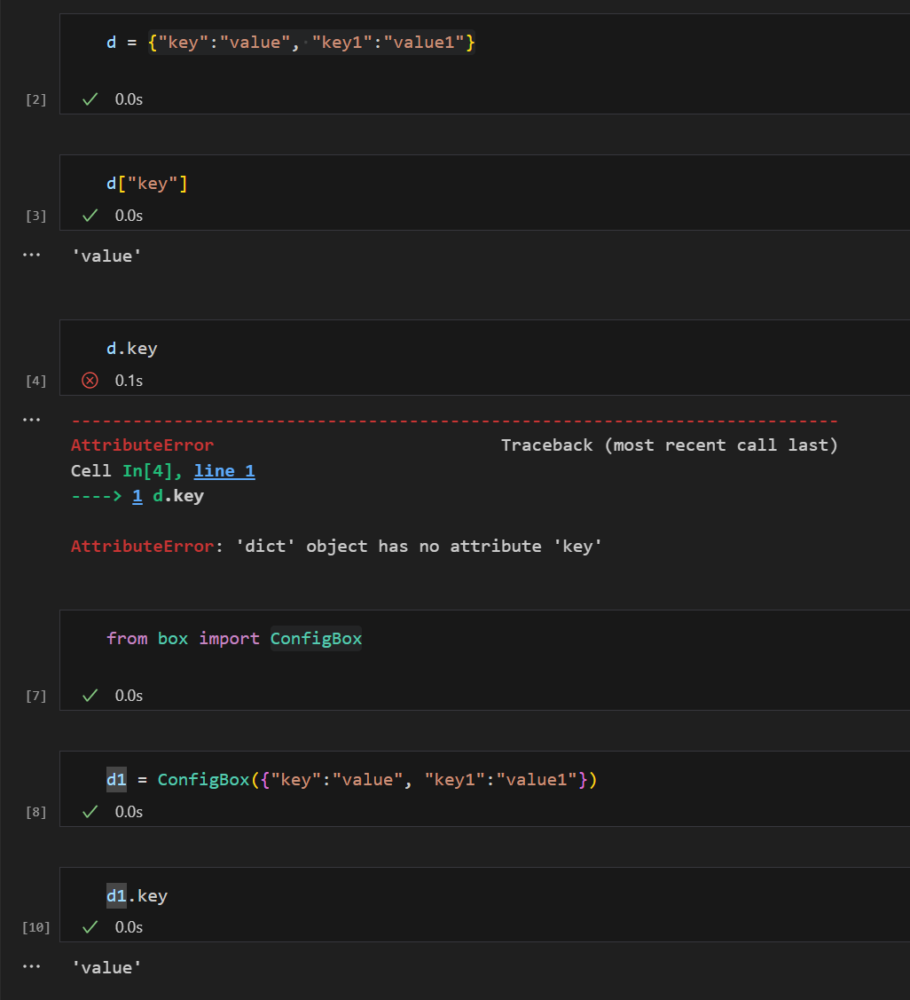
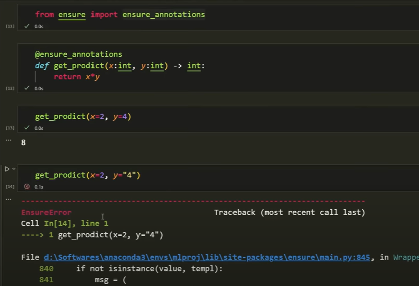

# End-to-End-DataScience-Project-with-MLFlow

## Create a conda environment with python 3.11, but not 3.12 it has some issues with the project packages installation
## Create a Repository in github and clone it into local workspace

### Create a template.py file -> We need lots of files and folders, instead of creating manually we create a script, so whenever we run this anywhere we gethn the folder structure.

- from pathlib import Path #this will directly convert to windows path like forward slashes to backward slashes
- Information level logging, it will save time stamp and error message
- we will create one folder called src, that will create mlproject and all folder structure in that
- we need this for CI/CD deployment using github action, to commit code empty folder can be pushed so gitkeep is required
- all constructor files are needed inside the mlproject folder
- here all configuration of project is stored
- creating for loop to create files, PATH is used to convert the file location into windows operatable format

### Requirements.txt file to be updated
- pandas 
- mlflow==2.2.2
- notebook
- numpy
- scikit-learn
- matplotlib
- python-box==6.0.2
- pyYAML
- tqdm
- ensure==1.0.2
- joblib
- types-PyYAML
- Flask
- Flask-Cors

### implement setup.py file
```pip install setuptools```
- this file is reqired to set up everthing as a local package so that importing one from other files dont pose errors
- after setting up run ``` pip install -r requirements.txt```

### logging, exception and utils files
- exception will be created seperately with python box
- create custom logging function in constructor inside mlPorject level
- now use that constructor in main.py by importing directly
```[2024-01-31 17:45:01,725: INFO: main: welcome to custom logging]``` -> sample log
- this helps in debugging during real time projects. When deployment errors occur or any issues can be seen in this log file.
- utils is functionalities that are used frequently, instead of reading everytime we put them in common.py file for reusability
- Importing packages like box exception, yaml, joblib, configbox etc
- Comments are in common.py file on why they are used

- this is usage of configbox to call configurations in yaml files using dot operator, easy to access
- why @ensure_annotation is required? This is a decorator to match the data types properly in functions


